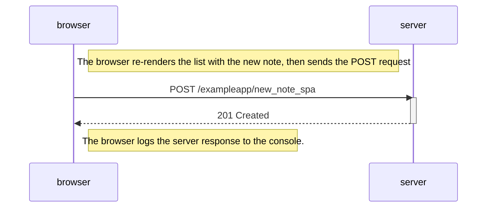
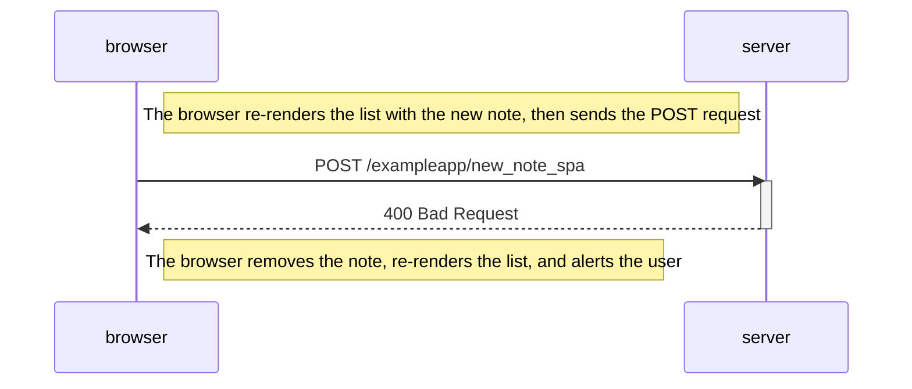

<!-- Depicts the situation where the user creates a new note using the single-page version of the app. -->

## Happy Path

```mermaid
sequenceDiagram
  participant browser
  participant server

  Note right of browser: The browser re-renders the list with the new note, then sends the POST request
  browser->>server: POST /exampleapp/new_note_spa
  activate server
  server-->>browser: 201 Created
  deactivate server

  Note right of browser: The browser logs the server response to the console.
```

## Rejection Path

```mermaid
sequenceDiagram
  participant browser
  participant server

  Note right of browser: The browser re-renders the list with the new note, then sends the POST request
  browser->>server: POST /exampleapp/new_note_spa
  activate server
  server-->>browser: 400 Bad Request
  deactivate server

  Note right of browser: The browser removes the note, re-renders the list, and alerts the user
```
